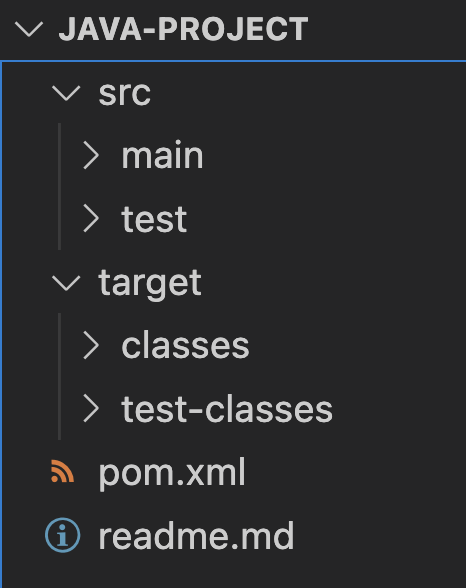

# Java Project Structure

## Overview

This is a short lesson to help learners understand the basic of java project structure. It will help to pace learners towards lesson 3.10 on spring maven.

## Coverage

1. Generate java project with maven
1. Understanding java project structure
    - `src` folder
    - `target` folder
1. Understanding `package` keyword
1. Proper way to run java project

Pre-requisites:
    - Java (you should have already installed)
    - Maven

Run `sdk install maven` before going through the steps.

---

## 1. Generate Java Project with Maven

Command to generate java project: 

```sh
mvn archetype:generate -DgroupId=com.edisonzsq.javaproject -DartifactId=javaproject -DarchetypeArtifactId=maven-archetype-quickstart -DinteractiveMode=false
```

|Terminology|Meaning|
|-|-|
|archetype|default project template provided by maven|
|artifact|the output of a project compilation such as `.class` or `.jar` file. Or even image for container hosting.|
|groupId|the `package` path|

---

## 2. Understanding Project Structure

The immediate file(s) and folders from the project root directory are:



Summary Table:

|Folder|Purpose|
|-|-|
|src|Where your source code lives|
|target|Where your compiled lives|
|src/main|Where your application code lives|
|src/test|Where your test code lives|
|target/classes|Where your compiled application code lives|
|target/test-lasses|Where your compiled test code lives|
|pom.xml|Stores project metadata and dependency information|

> Test codes are written to ensure the software behaves according to expectations

---

## 3. Understanding `package`

### The What and Why

The `package` is a reserved keyword in java and it can be applied once in every java class. We use it to categorize our code. 

### The How

Example of package names:

|Package|Purpose|
|-|-|
|`com.edisonzsq.javaproject.controllers`|Receive API Calls|
|`com.edisonzsq.javaproject.services`|Business Logics|
|`com.edisonzsq.javaproject.dataaccess`|Database Layer|
|`com.edisonzsq.javaproject.utils`|Utility classes such as thousand separator formatting for currency value| 

You would realize how these package path matches the project folder structure within `src/main/java`.

For now we have to rely on your imagination. This project is just a brief. There is not `controllers`, `services`, `dataaccess`, or `utils` folder. We will see more of that in the spring boot project.

---

## 4. Running Java Project

Step 1: Running `mvn package` would compile the project (produce an artifact). Or, `mvn clean package` to remove previous artifact and compile again.

Step 2: Add manifest to `pom.xml`

Add the following to `pom.xml` within the `<project>` tag, same level as `<dependencies>`.
```xml
  <build>
    <finalName>App</finalName>
    <plugins>
        <plugin>
            <groupId>org.apache.maven.plugins</groupId>
            <artifactId>maven-jar-plugin</artifactId>
            <version>3.1.2</version>
            <configuration>
                <archive>
                    <manifest>
                        <mainClass>com.edisonzsq.javaproject.App</mainClass>
                    </manifest>
                </archive>
            </configuration>
        </plugin>
    </plugins>
  </build>
```
Please adjust the value for `<finalName>` and `<mainClass>` according to your project.

Step 3: Execute the `.jar` file.

```sh
java -jar ./target/App.jar
```

End